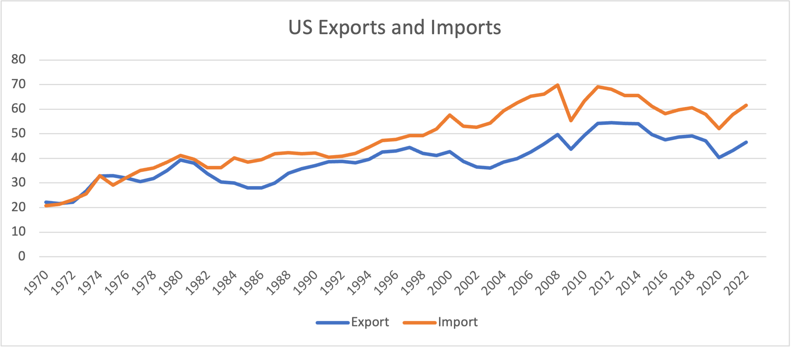
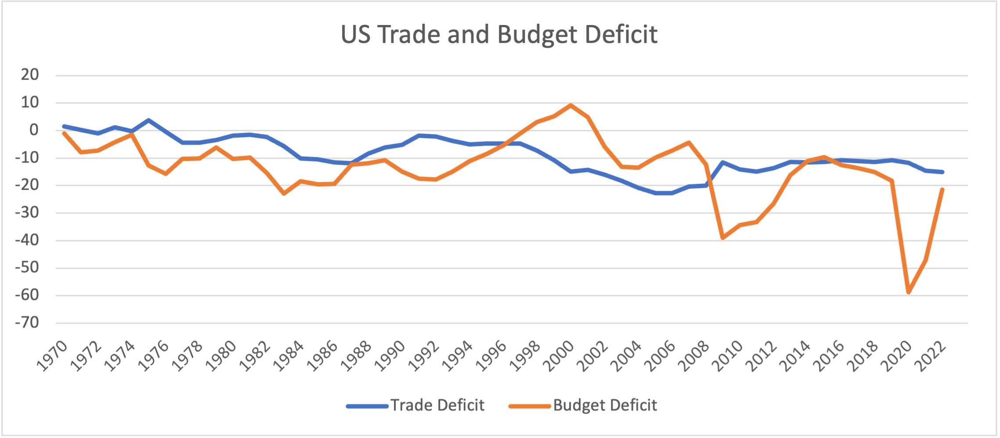

# Data Set Details

## Sources of the Data
In total, I've downloaded four data sets from FRED, within three csv files. They can be downloaded from FRED through the following links:
- Exports of Goods and Services [link](https://fred.stlouisfed.org/series/EXPGS)
- Imports of Goods and Services [link](https://fred.stlouisfed.org/series/IMPGS)
- Federal Surplus or Deficit [link](https://fred.stlouisfed.org/series/FYFSD)
- Nominal Gross Domestic Product for United States [link](https://fred.stlouisfed.org/series/NGDPSAXDCUSQ)
## Preview Information
### Imports and Exports
They are downloaded together in a csv file, can be accessed from [fredgraph-2](./data/fredgraph-2.csv). The imports and exports are recorded in billions of dollars, annually in average.
```
DATE,EXPGS,IMPGS
1970-01-01,59.7085000000000000,55.7600000000000000
1971-01-01,62.9627500000000000,62.3420000000000000
1972-01-01,70.8432500000000000,74.2155000000000000
1973-01-01,95.2695000000000000,91.1590000000000000
1974-01-01,126.6500000000000000,127.4647500000000000
1975-01-01,138.7062500000000000,122.7295000000000000
1976-01-01,149.5150000000000000,151.1455000000000000
1977-01-01,159.3485000000000000,182.4425000000000000
1978-01-01,186.8832500000000000,212.2497500000000000
1979-01-01,230.1295000000000000,252.6742500000000000
1980-01-01,280.7717500000000000,293.8282500000000000
1981-01-01,305.2390000000000000,317.7585000000000000
1982-01-01,283.2097500000000000,303.1840000000000000
1983-01-01,276.9962500000000000,328.6382500000000000
1984-01-01,302.3805000000000000,405.1072500000000000
1985-01-01,303.2105000000000000,417.2285000000000000
1986-01-01,320.9982500000000000,452.8670000000000000
1987-01-01,363.9430000000000000,508.7127500000000000
1988-01-01,444.6007500000000000,553.9937500000000000
```
### Budget Deficit
It's downloaded together in a csv file, can be accessed from [FYFSD-2](./data/FYFSD-2.csv). The budget deficit is recorded in millions of dollars every fiscal year.
```
DATE,FYFSD
1970-06-30,-2842
1971-06-30,-23033
1972-06-30,-23373
1973-06-30,-14908
1974-06-30,-6135
1975-06-30,-53242
1976-06-30,-73732
1977-09-30,-53659
1978-09-30,-59185
1979-09-30,-40726
1980-09-30,-73830
1981-09-30,-78968
1982-09-30,-127977
1983-09-30,-207802
1984-09-30,-185367
1985-09-30,-212308
1986-09-30,-221227
1987-09-30,-149730
1988-09-30,-155178
```
### Nominal GDP
It's downloaded together in a csv file, can be accessed from [NGDPSAXDCUSQ](./data/NGDPSAXDCUSQ.csv). The nominal GDP is recorded in millions of dollars annually.
```
DATE,NGDPSAXDCUSQ
1970-01-01,268327.650000000000
1971-01-01,291212.475000000000
1972-01-01,319778.025000000000
1973-01-01,356344.025000000000
1974-01-01,386310.650000000000
1975-01-01,421226.275000000000
1976-01-01,468353.150000000000
1977-01-01,520456.275000000000
1978-01-01,587899.725000000000
1979-01-01,656831.600000000000
1980-01-01,714327.150000000000
1981-01-01,801760.325000000000
1982-01-01,835947.325000000000
1983-01-01,908509.150000000000
1984-01-01,1009403.525000000000
1985-01-01,1084745.150000000000
1986-01-01,1144908.150000000000
1987-01-01,1213804.075000000000
1988-01-01,1309109.525000000000
```

## Tasks to clean up
As we can see in the raw data, they're all collected on different dates every year. In order to clean them up, I need a single heading for all the data, and each entry labeled with a year number. 
Also, since the economy is growing rapidly over time, I'm calculating the exports, imports and budget deficit as percentages of the nominal GDP that year, in order to make the further analysis and comparisons reasonable.
### Provide the uniformed headings
By reading all the data and append them to a new list, I can get the cleaned-up data written in a new csv file. Thus, I append the headings to the first entry in the list.
```
newline.append("Year,Budget Deficit,Export,Import\n")
```
### Using the year as the first column
I want to clean up all the dates and repeated time information across all the raw data, so I used the year mentioned in the budget deficit as the only time I include time information. The time (year) is the first four letters of the first word in each line of the raw data, except for the first line where the original headings live.
```
newline.append(words[0][:4] + "," + format(float(words[1])*100/float(words1[1]), ".2f"))
```
### Recording entries as percentages of the Nominal GDP
When I clean up the data, I used the information of GDP to calculate the percetage of each of my three entries, so that the outcome is both easier to read and also standardized the infromation so that it's more rational for the later analysis.
- Budget Deficit, both in billion
```
newline.append(words[0][:4] + "," + format(float(words[1])*100/float(words1[1]), ".2f"))
```
- Exports and Imports, in millions of dollars
```
newline[i+1] = newline[i+1] + "," + format(float(words[1])*100000/float(words1[1]), ".2f") + "," + format(float(words[2])*100000/float(words1[1]), ".2f") + "\n"
```

## The munged data and the spreadsheet
I saved the munged data in [clean_data.csv](./data/clean_data.csv), and imported it to a [spreadsheet](./data/clean_data.xlsx) for further analysis.


# Analysis
## Calculte the trade deficit
By definition, the trade deficit is exports - imports. So I created a new column with the exports - imports, labeled as trade deficit.
## Aggregate statistics
Since the data is a time series data, there's no reason to calculate the sum of each column, it makes no sense. So I calculated the average, minimum and maximum values of each column.
- average, minimum and maximum values using AVERAGE, MIN and MAX. The example code below shows the formula I used to get the average, minimum and maximum values of the budget deficit.
```
=AVERAGE(B:B)
=MIN(B:B)
=MAX(B:B)
```
- displaying the year that the maximum or minimum value exists using INDEX. The example code below shows the formula I used to get the year when the US has the minimum budget deficit with an exact match and minimum value saved in cell I2.
```
=INDEX(A:A, MATCH(I2, B:B, 0))
```
- in order to have four aggregate statistics, I also calculated the standard deviation of each column using STDEV.P to see how are the data distributed. The example code below is for calculating the budget deficit.
```
=STDEV.P(B:B)
```
- average, minimum and maximum values with conditions using AVERAGEIFS, MINIFS and MAXIFS. The example code below shows the formula I used to get them for the budget deficit. The conditions are decided after vewing the graph I produced from the data, which will be introduced in later section.
```
=AVERAGEIFS(B:B, A:A, "<2002")
=AVERAGEIFS(B:B, A:A, ">=2002")
=AVERAGEIFS(B:B, A:A, ">=2007", A:A, "<=2009")
=AVERAGEIFS(B:B, A:A, ">=2020")
=MAXIFS(B:B, A:A, "<2002")
=MINIFS(B:B, A:A, ">=2002")
```
## Charts
I created two charts.
- US Exports and US Imports as a percentage of Nominal GDP on the same plot

- US Trade and Budget Deficit as a percentage of Nominal GDP on the same plot


## Some insights
- Exports and Imports being more and more important to the US economy, as we can see the raising curves from the plot.
- The maximum of Imports and Exports turned out in 2008 and 2012, so dispite the growing trend, imports and exports were playing a smaller role in the nominal GDP recently.
- After 1976, US imports more than it exports, as percentage of GDP (crossing point from the chart). This phenomenon is probably due to more countries entering the international trade market as they were growing, since the change in imports is greater than exports.
- After 2002, the imports of the US has increased dramatically regarding it's increasment in exports, probably due to China joining the world trading market.
- Overall, the trade deficit has a smaller SD than the budget deficit, being more stable even during reccessions. This might imply that there are more factors other than trade that affects the US budget deficit. 
- The correlation of trade and budget deficit decreased greatly during recessions. During recession,the increasing spenature of government budget such as providing wellfare checks' impact is so huge that makes the trade's impact little. While the global trade is primarily related to customer's consumption behaviors, which merely changes during recessions, thus not showing significant changes during the recession.